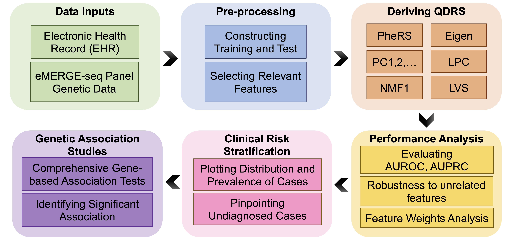
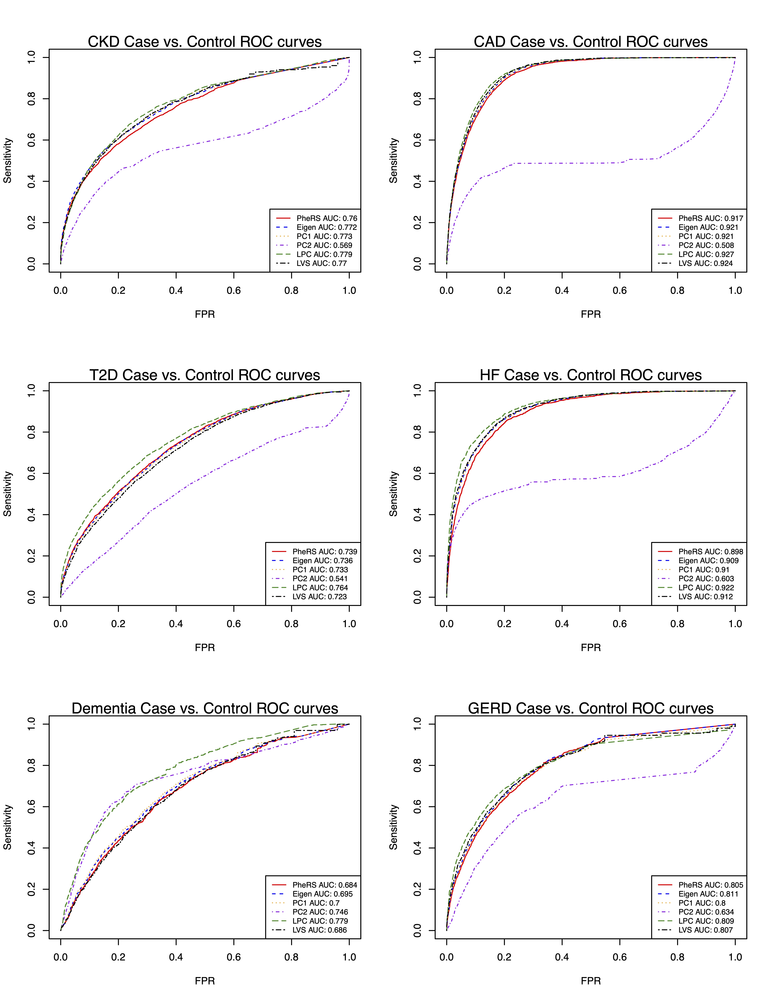
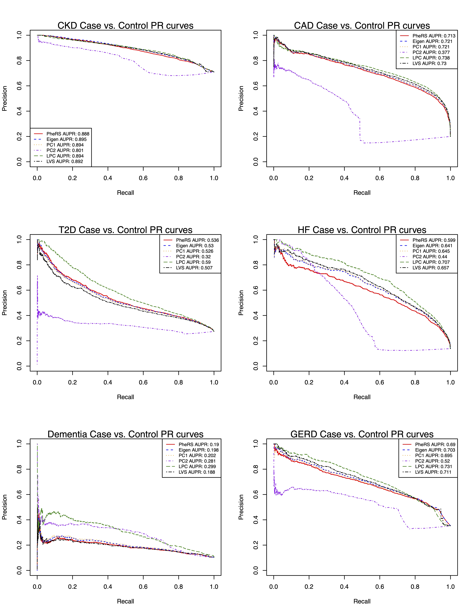
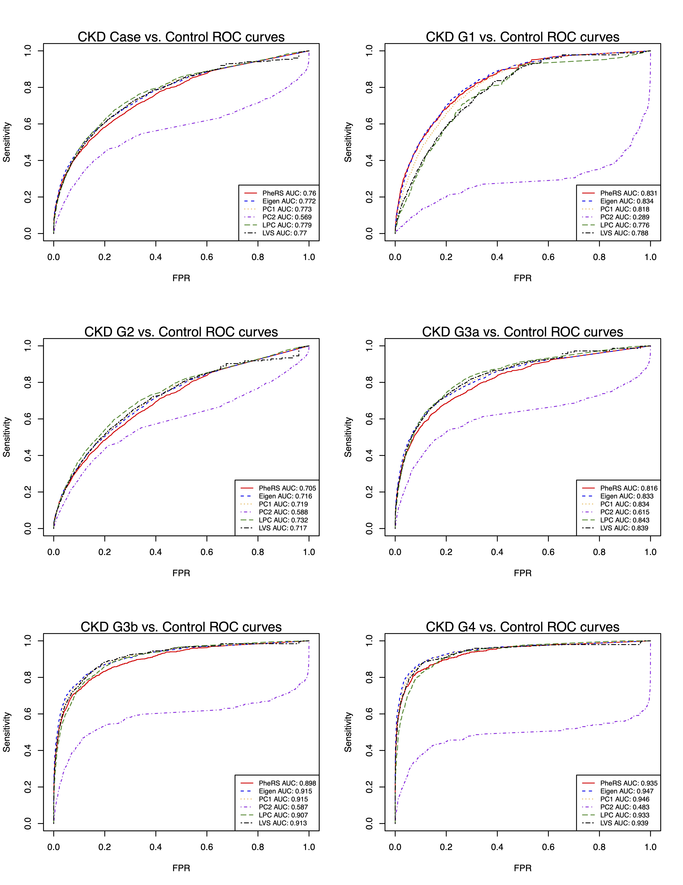
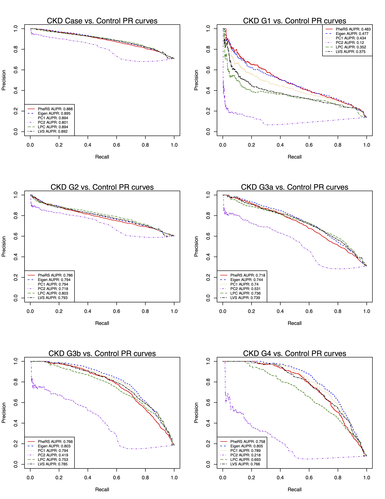
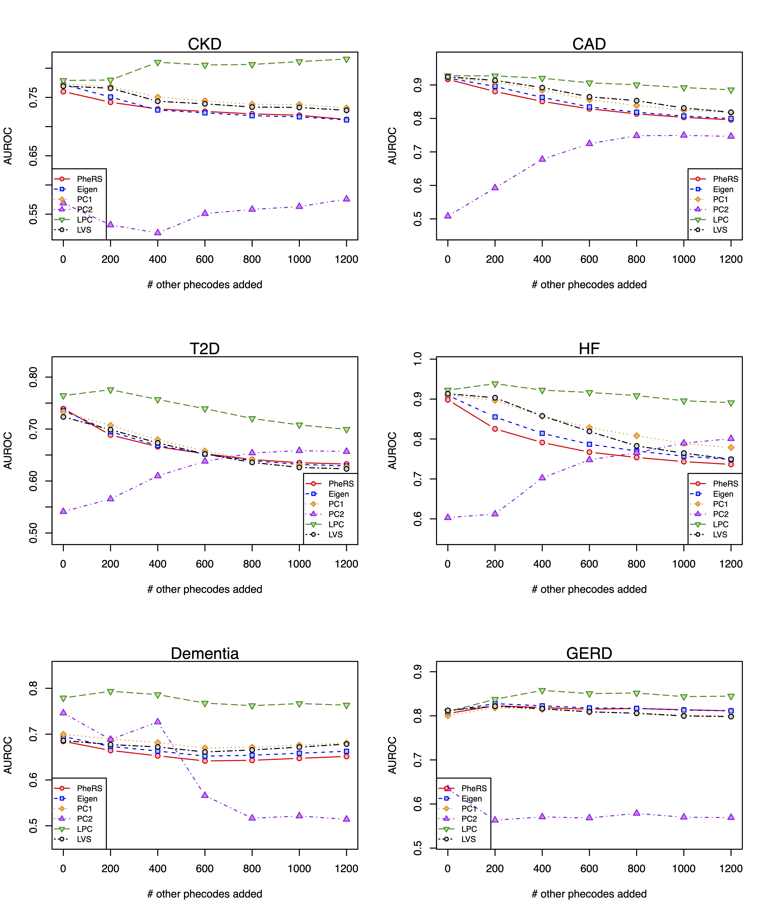
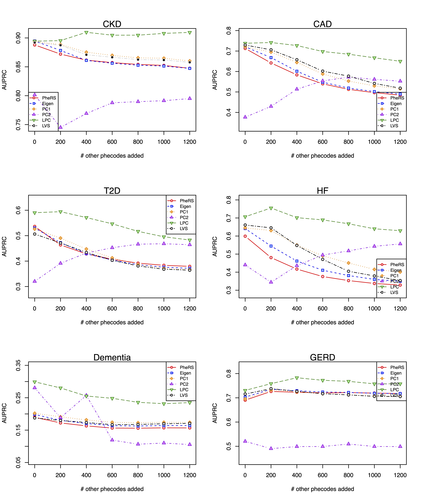
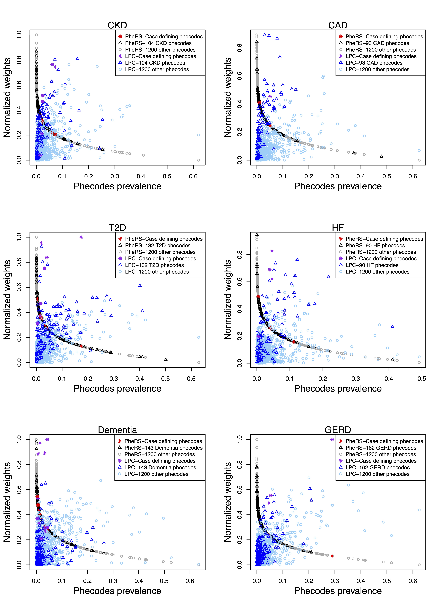
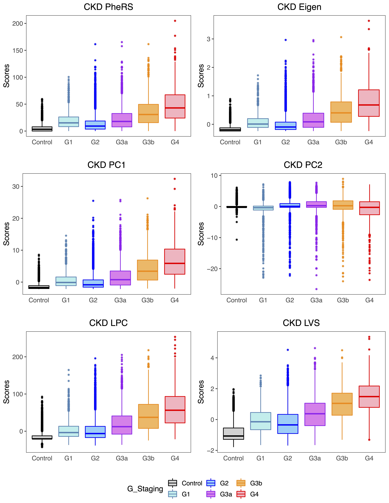
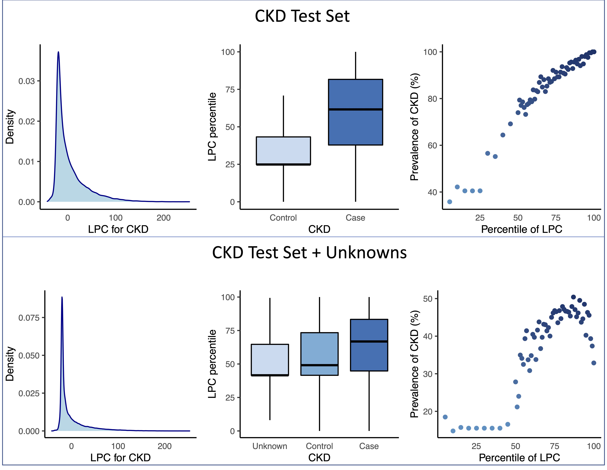

```{r setup, include = TRUE}
library(ggplot2)
library(knitr)
library(kableExtra)

knitr::opts_chunk$set(echo = TRUE)
```

# Introduction

This document describes quantitative disease risk scores (QDRSs) based on almost unsupervised methods along with the main features and functionality of the **QDRS** package, developed for the analysis of Electronic Health Record (EHR) data. The almost unsupervised methods require minimal input from clinicians, can be applied to large datasets, and alleviate some of the main weaknesses of existing phenotyping algorithms. The flow of analysis in an application to Electronic Medical Records and Genomics (eMERGE) network is provided in order to show how the QDRS can be applied to EHRs and genetic data.

The **development** version of QDRS from [Github](https://github.com/danqingxu/QDRS) can be installed and loaded as follows.

```{r install, eval = FALSE}
# install.packages("devtools")
devtools::install_github("danqingxu/QDRS")
library(QDRS)
# depends on development version of R package gllvm
#devtools::install_github("JenniNiku/gllvm")
```


---

# Methods

Suppose we have $J$ phenotypic features for a given set of $n$ subjects; these include phecodes, but can also include laboratory values and other clinical covariates. Each phenotypic feature is centered and scaled by its sample standard deviation in the preprocessing step. The goal is, for a given (complex) disease phenotype, to construct a quantitative disease risk score (QRS) as a weighted linear combination of multiple phenotypic features, i.e., the score for subject $i$ is defined as
$$
\text{QRS}_i = \sum_{j=1}^{J} w_j x_{ij},
$$
where $x_{ij}$ is the standardized value of $j$th phenotypic feature for subject $i$. Here we consider several possible unsupervised methods to derive the set of weights $w_j$'s. We denote by $\mathbf{X}_{n\times J}$ the matrix of $J$ standardized phenotypic features for the $n$ subjects.  Let $\mathbf{Q}$ be the $J\times J$ sample correlation matrix of the $J$ phenotypic features. 

## Phenotype Risk Score

The phenotype risk score (PheRS) has been recently proposed to combine binary phecodes in an individual [@bastarache2018phenotype], with phecodes' weights based on the inverse prevalence of the phecode in a given population. Here we use the controls and individuals with unknown status for a given disease, but one can also use an external reference population. Given a dataset of $N$ subjects, the weight for phenotypic feature $j$ is calculated as:
\begin{align*}
w_j = \log \frac{N}{n_j},
\end{align*}
where $n_j$ is the number of individuals with phenotypic feature $j$. Hence, less prevalent phenotypic features are given higher weight compared to the more common ones. The rationale behind this weighting scheme is that lower frequency phecodes are more likely to be related to risk of disease in general, an assumption that is likely to be reasonable. However, these weights are not related to the phenotype under consideration. 

For subject $i$, the PheRS for a specific disease is calculated as in @bastarache2018phenotype:
\begin{align}
\text{PheRS}_i = \sum_{j=1}^{J} w_j \mathbb{1}_{\{\text{subject } i \text{ has phenotypic feature }j\}}.
\end{align}


## Matrix Factorization Approaches

**Eigen Score.** The Eigen score is a spectral approach based on the correlation matrix $\mathbf{Q}$ of $J$ phenotypic features. We have previously proposed this approach in a different context, namely to derive functional scores for genetic variants [@eigen]. Assuming conditional independence of phenotypic features given the true disease status of an individual (either affected or unaffected), the off-diagonal entries of $\mathbf{Q}$ are identical to those of a rank-one matrix $\mathbf{R} = \lambda \mathbf{v} \mathbf{v}^\top$ with unit-norm eigenvector $\mathbf{v}$ and eigenvalue $\lambda$. Up to a sign ambiguity, the entries of $\mathbf{v}$ are proportional to the balanced accuracies (the average between the sensitivity and the specificity) of the $J$ phenotypic features. We construct an estimate $\hat{\mathbf{R}}$ of the rank-one matrix $\mathbf{R}$ by solving a system of equations as in [@eigen], and then we perform eigendecomposition of $\hat{\mathbf{R}}$ to obtain the leading eigenvector $\hat{\mathbf{v}}$. The weight of the $j$th phenotypic feature is defined as $\hat{v}_j$, the $j$th entry of $\hat{\mathbf{v}}$. The Eigen score of subject $i$ is the weighted sum of $J$ phenotypic features:
\begin{align*}
\text{Eigen}_i = \sum_{j=1}^{J}x_{ij}\hat{v}_j,
\end{align*}
where $x_{ij}$ is the standardized value of the $j$th phenotype for subject $i$. 

**Principal Component Analysis.** Principal component analysis (PCA) is an alternative approach to reduce the dimension of the phenotypic feature space, and identify a small number of principal components (PCs). In particular, we have the spectral decomposition of $\mathbf{Q}$, $\mathbf{Q}=\sum_{j=1}^{J}\lambda_j\mathbf{u}_j\mathbf{u}_j^\top$, where $\lambda_1\geq \cdots \geq \lambda_J>0$ are eigenvalues of $\mathbf{Q}$ and $\mathbf{u}_j$ is the $j$th eigenvector associated with the $j$th largest eigenvalue.

One possible composite score is based on using the entries of the top eigenvector $\mathbf{u}_1$ (i.e. the loadings) as the weights for the $J$ phenotypic features. We call this score PC1. Unlike the weights defined by Eigen which are related to the balanced accuracies of the individual features, the weights defined by $\mathbf{u}_1$ are not guaranteed to reflect prediction accuracies. Furthermore, it is possible that additional principal components are also informative [@aschard2014maximizing; @zhonghua], and so we consider combining multiple PCs as a linear combination (LPC), especially when including a large number of phenotypic features. The general form of the LPC score for subject $i$ is 
\begin{align*}
\text{LPC}_i = \sum_{k=1}^{K}\beta_k\text{PC}_{ik},
\end{align*}
where $K\leq J$ represents the number of PCs being included in the linear combination, and $\textbf{PC}= \mathbf{X}\mathbf{U}$ is the PC score matrix ($\mathbf{U}$ is the matrix of eigenvectors). $K$ can be determined using the Tracy-Widom test [@TW], a hypothesis test to identify significant eigenvalues of the covariance matrix.

There are several considerations with the LPC method. The first is the choice of sign of individual PCs in the linear combination. We use the training data (see below) to help us identify the sign of each PC. Namely, the sign of each PC is adjusted so that the mean PC value of "cases" is higher than that for "controls". Although we refer to the LPC approach as unsupervised, we do use some approximate label information to determine the signs of individual PCs in the linear combination. However, we do not need to use gold standard labels, and weakly defined labels are sufficient (e.g. we could define as "cases" those individuals with some lab result present, e.g. the estimated glomerular filtration rate (eGFR) in the case of Chronic Kidney Disease). The second important consideration is the choice of weights. We choose here to use the corresponding eigenvalues $\lambda$ as weights, so higher weight is assigned to those components with higher amount of variance explained. However the lower PCs (corresponding to smaller eigenvalues) can be as useful for prediction as the top PCs, and hence the approach here may not be optimal. If some amount of labeled data is available, weights can be learned by regression models, such as principal component regression and partial least squares.

<!-- **Non-negative Matrix Factorization.** Another possible approach would be to do non-negative matrix factorization (NMF) [@nmf2]. Unlike PCA, NMF constrains the factor loadings to be non-negative. Although we do not expect improved accuracy compared with the less constrained PCA approach, NMF can lead to better interpretability.  -->

<!-- The phenotypic features matrix $\mathbf{X}$ can be tranformed into a non-negative matrix, denoted by $\tilde{\mathbf{X}}_{n\times J}$. NMF factorizes the non-negative matrix $\tilde{\mathbf{X}}$ into two non-negative rank-$K$ matrices $\mathbf{M}_{n\times K}$ and $\mathbf{H}_{K\times J}$ such that $\tilde{\mathbf{X}}_{n\times J} \approx \mathbf{M}_{n\times K}\mathbf{H}_{K\times J}$, where $K\leq J$. Column $j$ of $\tilde{\mathbf{X}}$ is approximately a linear combination of the columns of $\mathbf{M}$, with the coefficients being column $j$ of $\mathbf{H}$. -->

<!-- Setting NMF rank $K=1$,  the entries of the column matrix $\mathbf{M}_{n\times 1}$ can be used as a risk score, which we call NMF1. The NMF1 score for subject $i$ is $m_i$, the $i$th entry of $\mathbf{M}$. The entries of pseudoinverse of $\mathbf{H}_{1 \times J}$, denoted by $\mathbf{H}^\dagger$, are the weights for the $J$ phenotypic features. Given a new subjects' feature vector $x$ for the same $J$ features, the NMF1 score for this new subject is $x\mathbf{H}^\dagger$. With $K > 1$, the result matrices of NMF can help to discover potential subgroups, where the $i$th row of $\mathbf{M}_{n\times K}$ indicates the membership of $K$ subgroups. -->

## Unsupervised Multivariate Mixed Model Framework
 

Generalized linear latent variable models (GLLVMs) are popular tools for modeling multivariate, correlated, mixed outcomes [@sammel1997latent]. But a main drawback of this model is the computational cost. A recently proposed framework for efficient estimation of GLLVMs, motivated by high-dimensional multivariate abundance data, using either the Laplace approximation method or the variational approximation method, reduces the computational burden for fitting GLLVMs with multivariate phenotypic data [@niku2019efficient]. We consider the $J$ observed phenotypic features $\mathbf{x}_i=(x_{i1},\ldots,x_{iJ})^\top$ are the physical manifestation of an unobserved latent variable $b_i$ that follows a normal distribution $f(b_i)$, and a generalized latent variable model regresses the mean phenotypic features, denoted as $\mu_{ij}$, against the latent variable $b_i$, $g(\mu_{ij}) = \beta_{j}+\theta_jb_i$, where $\beta_{j}$ and $\theta_j$ are feature specific intercept and slope coefficient related to the latent variable, and $g(\cdot)$ is the corresponding link function, e.g. probit function links the probability of success for a binary outcome and the latent variable. Then the posterior estimate of the latent variable $b_i$ for an individual $i$, which we call LVS, is an estimate of severity for a particular phenotype based on the observable phenotypic features. The estimation of GLLVM is based on a variational approximation method, originally developed in the machine learning field [@wainwright2008graphical] to approximate the posterior distribution $h(b\vert \mathbf{x}_i)$ by a variational density (e.g. a normal density) while minimizing the Kullback-Leibler divergence between the true posterior density and the proposed variational density.

## R Functions

Main functions of the **QDRS** package can be used to compute the QDRS based on the above mentioned methods with the arguments listed in the following (See examples in Section **Analysis of eMERGE Data**>**Deriving QDRS**):


```{r, eval = FALSE, echo = TRUE}
PheRS(X, feature.prevalence = NULL, group = NULL)
eigen.score(X, training, scale = TRUE)
PC(X, group, training, scale = TRUE, pc.num)
LPC(X, group, training, scale = TRUE)
LVS.score(X, Y = NULL, family = "binomial",
          starting.choice = "random", p.seed = 3080)
```


The argument `X` in functions `PheRS(), eigen.score(), PC(), LPC()` represents the input feature matrix. The PheRS weights can be specified directly through the argument `feature.prevalence`, derived from controls  provided by the argument `group`, or simple calculated using all subjects if neither of these two arguments are available. The argument `training` is an index or logical vector that indicates whether the subject is used for training. 

For `LVS.score()` function, the training and test sets are specified through the arguments `X` and `Y` respectively. The default of argument `family`, distribution function for features, is `"binomial"`. List of available distributions with the mean, $E(y_{ij})$, and mean-variance, $V(\mu_{ij})$, functions, and link functions for various response types are in the table below. The mean and mean-variance are estimated by variational approximation methods.

| Response    | Distribution | Link  | Description                |
| ----------- |:------------:|:------- |:---------------------------|
|Counts  	    | Poisson 	   |log	    | $E(y_{ij}) = \mu_{ij}$, $V(\mu_{ij})=\mu_{ij}$|
|             | NB    	     |log		  | $E(y_{ij}) = \mu_{ij}$, $V(\mu_{ij})=\mu_{ij}+\phi_j\mu_{ij}^2$,|
|		          |		           |		    | where $\phi_j>0$ is a dispersion parameter | 
|Binary       | Bernoulli 	 |probit  | $E(y_{ij}) = \mu_{ij}$, $V(\mu_{ij}) = \mu_{ij}(1-\mu_{ij})$|
|Ordinal 	    | Multinomial  |probit  | Cumulative probit model|
|Normal       | Gaussian     |identity| $E(y_{ij}) = \mu_{ij}$, $V(y_{ij}) = \phi_j^2$|
|Positive continuous| Gamma     |log| $E(y_{ij}) = \mu_{ij}$, $V(y_{ij}) = \mu_{ij}^2/\phi_j$|
|		          |		           |		    | where $\phi_j$ is a shape parameter |
|non-negative continuous| Exponential |log| $E(y_{ij}) = \mu_{ij}$, $V(y_{ij}) = \mu_{ij}^2$|


---

# Analysis of eMERGE Data

The proposed methods have been applied to six different diseases, which include Chronic Kidney Disease (CKD), Coronary Artery Disease (CAD), Type 2 Diabetes (T2D), Heart Failure (HF), Dementia and Gastroesophageal Reflux Disease (GERD). Here we focus on CKD for illustration purposes. This section will follow the flow chart in Figure \@ref(fig:FlowChart) to show the analysis of eMERGE data sets as an example. The data set description of eMERGE-seq panel genetic data is arranged to Section **Genetic Association Studies**.

```{r FlowChart, layout="l-page", fig.width = 12, fig.cap = "**Analysis Flow Chart of eMERGE Application.**", echo = FALSE}

```

## Data Inputs

The Chronic Kidney Disease (CKD) cohort consists of 98,486 (102,597 individuals with phecodes in eMERGE, minus 4,111 End Stage Renal Disease (ESRD) patients) subjects with demographic information such as gender, race, age, and 1,817 phecodes that are divided into 18 categories (1,866 phecodes minus 49 zero-prevalence phecodes, Table \@ref(tab:PhecodeCounts). 

```{r PhecodeCounts, layout="l-body-outset", echo = FALSE}
load("data/phecode_category_counts.rda")
library(rmarkdown)
library(kableExtra)
rownames(order.tb) = NULL
kable(order.tb, caption = "**The number of phecodes with non-zero prevalence in the eMERGE dataset for each category.**", booktabs = TRUE) %>%
  kable_styling(bootstrap_options = c("striped", "hover", "condensed", "responsive"),fixed_thead = T)
```

Each individual in the eMERGE network has raw longitudinal records of ICD-9 and ICD-10 codes, which can be mapped to phecodes [@phecodes], and the presence of a particular phecode is defined by at least two occurrences of the corresponding ICD-9 or ICD-10 codes in individual health records. Each phecode is used as a proxy of the corresponding condition. Note that here the absence of a phecode may be due to no assessment of the condition or no record of healthy condition. 


## Pre-processing

The phecodes history of the CKD cohort is reformatted in wide format, i.e., each row represents a subject, each column represents a phecode and entries are indication of the phecodes. The feature matrix of 98,486 individuals are centered and scaled before splitting into training and test sets for the Eigen and PC-based approaches. The phecode features are on the original scale for PheRS and LVS derivation.

```{r dataset, layout = "l-page", echo = FALSE}
load("data/example_feature_matrix.rda")
kable(example_unscaled,caption = "**Example CKD Dataset.**", booktabs = TRUE) %>%
  kable_styling(bootstrap_options = c("striped", "hover", 
                                      "condensed", "responsive"),fixed_thead = T)
```

We took advantage of a CKD phenotyping algorithm recently developed within eMERGE to diagnose and place individuals on a CKD staging grid by estimated glomerular filtration rate (eGFR) [@ckd_alg] (eGFR slope is a commonly used indicator of global kidney function).  The CKD stages include Control, G1, G2, G3a, G3b, and G4. We divided the case-control dataset in Table \@ref(tab:PhenotypeCounts) into two parts, and used 50\% of the cases and 50\% of controls for training purposes. We used 104 feature phecodes to build the quantitative disease risk scores, the choice of which is explained in the next section.

For consistency, we focused on the same set of 98,486 subjects as above in the analyses of additional phenotypes, including Coronary Artery Disease (CAD), Type 2 Diabetes (T2D), Heart Failure (HF), Dementia, and Gastroesophageal Reflux Disease (GERD). CAD case definition was based on a composite of myocardial infarction [@khera2018genome]. Myocardial infarction was based on self-report or hospital admission diagnosis. This included individuals with ICD-9 codes of 410.X, 411.0, 412.X, or 429.79, or ICD-10 codes of I21.X, I22.X, I23.X, I24.1, or I25.2 in hospitalization records. The case/control definitions of T2D, HF, Dementia and GERD are based on the validated algorithms available at the Phenotype KnowledgeBase (PheKB) [@T2D_phekb;@HF_phekb;@dementia_phekb;@gerd_phekb]. We used 50\% of the cases and an equal number of controls for training, and the rest of the cases and controls as test set for performance evaluation. The number of cases and controls for each phenotype are listed in Table \@ref(tab:PhenotypeCounts). Those individuals who are neither case nor control for a given phenotype are treated as having unknown status.

```{r PhenotypeCounts, layout="l-body-outset", echo = FALSE}
load("data/phenotype_counts.rda")
rownames(phenotype_counts) = NULL
kable(phenotype_counts, caption = "**Number of individuals (cases vs. controls) in training and test datasets.**", booktabs = TRUE) %>%
  kable_styling(bootstrap_options = c("striped", "hover", "condensed", "responsive"),fixed_thead = T)
kable(ckd.cases, booktabs = TRUE) %>%
  kable_styling(bootstrap_options = c("striped", "hover", "condensed", "responsive"),fixed_thead = T)
```

We focused on including as phenotypic features those phecodes that we deemed possibly relevant to the disease under consideration. In order to be able to validate the resulting quantitative disease risk scores, we have excluded the case defining phecodes (Table \@ref(tab:CaseDefining)). Note that this was done only for evaluation purposes, and in the final scores we did include such phecodes. For CKD, we included 104 CKD phecodes (manually selected by experts), 93 CAD phecodes (among the 'circulatory system' category, those with p-values <10^{-5} in logistic regression of each phecode against CAD polygenic risk scores), 132 T2D phecodes (manually selected by experts among the significant phecodes with p-values <10^{-5} in logistic regression of each phecode against T2D polygenic risk scores), 90 HF phecodes (CAD feature phecodes with HF case defining phecodes removed), 143 Dementia phecodes (from the 'mental disorder' and 'neurological' categories) and 162 GERD phecodes (from the 'digestive' category). 

<!-- More details on the polygenic risk score calculation for the individuals in eMERGE are in the Materials and Methods section.   -->

```{r CaseDefining, layout="l-body-outset", echo = FALSE}
library(kableExtra)
load("data/Case_defining_phecodes.rda")
kable(Case_defining_phecodes, caption = "**Phecodes that are used to define cases for phenotypes (at least one occurrence) in eMERGE dataset.**", booktabs = TRUE) %>% collapse_rows(columns = 1, latex_hline = "major", valign = "middle") %>%
  kable_styling(bootstrap_options = c("striped", "hover", "condensed", "responsive"),fixed_thead = T)
```


<!-- Depending on the disease under consideration, we may or may not be able to use expert knowledge to select the phecodes, and we might have to rely on a combination of expert knowledge and more data driven approaches as above. We have investigated the effect of the ways we selected the 'relevant' phecodes for T2D, and we have overall observed minimal differences in accuracy (Table \ref{tb:phecodes_t2d}). -->

## Deriving QDRS

This section provides CKD as an example of deriving quantitative disease risk scores. The details of this data set and selection of CKD 'relevant' phecodes are described in Section **Data Inputs** and **Pre-processing**.

```{r loading, eval = FALSE}
# load the CKD training set
# two phecode matrices
load("data/ckd_phedat_training.rda")
dim(ckd_phedat_training)
#[1] 25231  1874
dim(ckd_phedat_training_unscaled)
#[1] 25231  1874
load("data/ckd_phedat_test.rda")
dim(ckd_phedat_test)
#[1] 25232  1874
dim(ckd_phedat_test_unscaled)
#[1] 25232  1874

# load the list of relevant phecodes including the case defining phecodes
load("data/ckd_phecodes_list.rda")
length(ckd_phecodes)
#[1] 104
length(ckd_label_phecodes)
#[1] 6
```


**PheRS.** The weights (prevalences) for the PheRS for each phenotype were estimated based on the set of non-cases (controls plus individuals with unknown status). Then the PheRS weights are computed as the log of inverse prevalence of the phecodes. The following codes are calculating phecode prevalence for CKD based on the controls plus the individuals with unknown status:

```{r PheRSweights, eval= FALSE}
# load the phecode matrix
load("/Volumes/Seagate Bac/Multiple Phenotypes/common/phecode_dat_eMERGE.rda")
phecode_mat = as.data.frame(Phecode_matrix[!duplicated(Phecode_matrix[,1]),])
# load the algorithm defined CKD labels
load("/Volumes/Seagate Bac/Multiple Phenotypes/common/eMERGE_ckd_labels.rda")
# merge the phecode matrix with label information matrix
phecode_mat = merge(eMERGE_ckd_labels, phecode_mat, by.x="eMERGE_ID", by.y="ID", sort=F)
phecode_mat_ckd_health = phecode_mat[phecode_mat$Group=="Control",]
prevalence.ckd = colMeans(phecode_mat_ckd_health[,-c(1:7)])
# reformat as data frame
prevalence.ckd = matrix(prevalence.ckd,nr=1)
colnames(prevalence.ckd) = colnames(phecode_mat_ckd_health[,-c(1:7)])
```

```{r prevalence, echo = FALSE}
load("data/phecode.prevalence.rda")
subexample = round(phecode.prevalence[,c("prevalence.ckd","prevalence.cad","prevalence.T2D","prevalence.hf","prevalence.Dementia","prevalence.gerd")],3)
colnames(subexample) <- c("CKD", "CAD", "T2D", "HF", "Dementia", "GERD")
temp <- data.frame(code = phecode.prevalence$code, subexample)
rownames(temp) = NULL
kable(tail(temp), caption = "**Example: Prevalence of Phecodes Listed by Phenotypes.**", booktabs = TRUE, ) %>%
  kable_styling(bootstrap_options = c("striped", "hover", "condensed", "responsive"),fixed_thead = T)
```

Here we derive CKD PheRS weights from the training set based on the prevalence computed above, then use the `predictQDRS()` function to predict the PheRS for test set.  

```{r PheRSExample, eval = FALSE}
load("data/prevalence.ckd.rda")
PheRS.res = PheRS(X = ckd_phedat_training_unscaled[,ckd_phecodes],
                  feature.prevalence = as.numeric(prevalence.ckd[,ckd_phecodes]))
PheRS.test = predictQDRS(Y = ckd_phedat_test_unscaled[,ckd_phecodes], 
                         weights = PheRS.res$weights)
ckd.QDRS.test = data.frame(Group = ckd_phedat_test$Group, 
                           G_Staging = ckd_phedat_test$G_Staging, 
                           PheRS = as.vector(PheRS.test))
```

**Eigen.** The calculation of Eigen has two steps: (1) estimate the rank-one R matrix, and (2) solve the system of linear equations described in Section **Methods**. For the matrix factorization approaches, if the data set is not large, setting the arguments that `X` to the entire original data set, `training` to the index/indicator vector for training subset, and `scale` to logical value `TRUE`, means the function will first scale the data set, then use the specified subset to train the weights, and compute the scores for all subjects.

```{r eigen, eval = FALSE}
phecode_m = ckd_phedat_training[,ckd_phecodes]
# this is the scaled training set (pre-processed the union of training and test set)
# so set training to all row numbers
# then the function returns weights and scores 
Eigen.res = eigen.score(X = phecode_m, 
                        training = 1:nrow(phecode_m), 
                        scale = FALSE)
Eigen.test = predictQDRS(Y = ckd_phedat_test[,ckd_phecodes], 
                         weights = Eigen.res$weights)
ckd.QDRS.test = data.frame(ckd.QDRS.test, 
                           Eigen = as.vector(Eigen.test))
```

**Individual PC.** The sign of principal component depends on the computation platform. Hence, the individual PC has a step of using the existing algorithm defined case-control status to select the sign, i.e., selecting the sign so that the cases have higher mean scores for training set.

```{r pcs, eval = FALSE}
PC.res = PC(X = phecode_m, 
            group = ckd_phedat_training$Group, 
            training = 1:nrow(phecode_m), 
            scale = FALSE, 
            pc.num = 1:2)
PC12.test = as.data.frame(predictQDRS(Y = ckd_phedat_test[,ckd_phecodes], 
                                      weights = PC.res$weights))
ckd.QDRS.test = data.frame(ckd.QDRS.test, 
                           PC12.test)
```


**LPC.** The LPC score is a weighted linear combination of multiple above mentioned PCs, where the weights are the corresponding eigenvalues. The number of significant eigenvalues are determined by Tracy-Widom test. Tracy-Widom test suggested 9, 12, 14, 11, 8, and 20 significant eigenvalues (PCs) of the covariance matrix of feature phecodes for CKD, CAD, T2D, HF, Dementia and GERD, respectively.

```{r LPC, eval = FALSE}
LPC.res = LPC(X = phecode_m, 
              group = ckd_phedat_training$Group,
              training = 1:nrow(phecode_m), 
              scale = FALSE)
LPC.test = as.data.frame(predictQDRS(Y = ckd_phedat_test[,ckd_phecodes], 
                                     weights = LPC.res$weights))
ckd.QDRS.test = data.frame(ckd.QDRS.test, 
                           LPC.test)
colnames(ckd.QDRS.test)[3:7] = c("PheRS", "Eigen", 
                                 "PC1","PC2","LPC")
```

<!-- **NMF1.** The columns and rows of all zeros in the training sets are not used. That means the features with no variation has zero weight (not informative) and the subjects with all zero entries has score 0.  -->

<!-- ```{r NMF1, eval = FALSE} -->
<!-- NMF1.res = NMF1(X = ckd_phedat_training_unscaled[, ckd_phecodes], p.seed = 8293) -->
<!-- NMF1.test = predictQDRS(Y = ckd_phedat_test_unscaled[,ckd_phecodes],  -->
<!--                         weights = NMF1.res$weights) -->
<!-- ckd.QDRS.test = data.frame(ckd.QDRS.test,  -->
<!--                            NMF1.test) -->
<!-- ``` -->


**LVS.** The training step is to fit a generalized linear latent variable models (GLLVM) with one latent variable using variational approximation method for multivariate bernoulli data. The next step is to predict the latent variable at new observations. For the LVS, because of the computational burden, we used a subset of the CKD training set (Control: 2,444, G1:395, G2: 3,701, G3a: 1,102, G3b: 555 and G4: 213) to train the latent variable model. Note that if the starting point is `random` (default value), then the derived scores may be slightly different from different runs.

```{r LVS, eval = FALSE}
load("data/ckd_phedat_training_lvs.rda")
dim(ckd_phedat_training_unscaled)
#[1] 8410 1874
# this computation may take a long time
#LVS.test = LVS.score(X = ckd_phedat_training_unscaled[,ckd_phecodes], 
                     Y = #ckd_phedat_test_unscaled[,ckd_phecodes],
                     p.seed = 2032)
# Recommend: compute LVS on server
# fit the model first
# then predict the values in subsets in parallel
LVS.model = LVS.fit(X = ckd_phedat_training_unscaled[,ckd_phecodes], 
                    family = "binomial",
                    p.seed = 2032)
# predict subset, e.g., 50 in a subset
LVS.test.sub = predictLVS(ckd_phedat_test_unscaled[1:50,ckd_phecodes], 
                      LVS.model)
```


## Performance Analysis

We compared the different scores in terms of area under the receiver operation characteristic curve (AUROC) and the area under the precision recall curve (AUPRC) in the test datasets. We observed that LPC exhibits the largest AUROC compared with PheRS: 0.779 vs. 0.76 for CKD, 0.927 vs. 0.917 for CAD, 0.764 vs. 0.739 for T2D, 0.922 vs. 0.898 for HF, 0.779 vs. 0.684 for Dementia, and the second largest AUROC compared with PheRS for GERD (0.809 vs. 0.805) (Figure \@ref(fig:roc1)). LPC also has the largest AUPRC for all studied phenotypes (Figure \@ref(fig:pr1)). PC2 has weak performance in general with AUROCs 0.569 for CKD, 0.508 for CAD, 0.541 for T2D, 0.603 for HF and 0.634 for GERD.  

```{r roc1, layout="l-body-outset", fig.width = 12, fig.cap = "**ROC curves cases vs. controls for six phenotypes.**", echo = FALSE}

```

```{r pr1, layout="l-body-outset", fig.width = 12, fig.cap = "**PR curves cases vs. controls for six phenotypes.**", echo = FALSE}

```

Similar results were obtained when comparing controls with cases at different CKD G stages (Figures \ref(fig:ckdROC1) and \@ref(fig:ckdPR1)). Note that the AUROC values are much higher when contrasting controls with more advanced stages of CKD (G3b: 0.907 for LPC, G4: 0.933 for LPC). 

```{r ckdROC1, layout="l-body-outset", fig.width = 12, fig.cap = "**ROC curves for CKD Cases vs. Controls, and CKD cases at different G stages vs. controls.**", echo = FALSE}

```

```{r ckdPR1, layout="l-body-outset", fig.width = 12, fig.cap = "**PR curves for CKD Cases vs. Controls, and CKD cases at different G stages vs. controls.**", echo = FALSE}

```

**R functions to compare performance.** Figure \@ref(fig:roc1)-\@ref(fig:ckdPR1) are generated by some hard coding for this application. The `multiple.roc.curve()` and `multiple.pr.curve()` can generate similar plots for grouping level contrast, e.g. Case vs. Control. The resulting score matrix `score.mat` have subjects as rows and different scores as columns, and `score.names` is the vector of column names for comparison.

```{r, eval = FALSE}
multiple.roc.curve(
  disease,
  output.date = NULL,
  score.mat,
  score.names,
  group,
  group.levels,
  legend.pos = "bottomright",
  pairs.sub = NULL
)

multiple.pr.curve(
  disease,
  output.date = NULL,
  score.mat,
  score.names,
  group,
  group.levels,
  legend.pos = "bottomright",
  pairs.sub = NULL
)
```

We now consider the impact of adding many more phecodes as possible phenotypic features to the computation of the quantitative disease risk scores. We randomly selected phecodes among the 1,817 phecodes available, and assess the effect of including them on the accuracy of the resulting scores. We added phecodes sequentially and evaluated the performance of different methods. The AUROC values for the different methods as a function of the number of random phecodes added is shown in Figure \@ref(fig:roc2). As shown, with the exception of PC2, the quantitative disease risk scores tend to be quite robust to the addition of new phecodes, with the LPC method showing even some improvement for CKD, suggesting that, as more phecodes are added, additional PCs can capture more information. See Figure \@ref(fig:pr2) for similar pattern in AUPRC values. 

```{r roc2, layout="l-body-outset", fig.width = 12, fig.cap = "**AUROC for cases vs. controls with increasing number of phecodes.**", echo = FALSE}

```

```{r pr2, layout="l-body-outset", fig.width = 12, fig.cap = "**AUPRC for cases vs. controls with increasing number of phecodes.**", echo = FALSE}

```

Although this robustness may seem surprising, it is important to note that the training datasets are **different** for the different diseases (each training dataset is enriched in cases for the disease under consideration), which leads to different correlation patterns among the phecodes. Indeed, we show that the weights for the 'relevant' phecodes are significantly higher compared with those of the additional phecodes for the proposed quantitative disease risk scores (Table \@ref(tab:Wilcoxon)). Although PheRS does surprisingly well with the addition of new phecodes, the weights derived by the PheRS are not significantly different between the `relevant' phecodes used originally and the newly added ones. The PheRS weights are negatively correlated with the LPC weights (Figure \@ref(fig:PheRSLPC1200weights)).

```{r Wilcoxon, layout="l-page", echo = FALSE}
load("data/wilcox_added_phecodes.rda")
library(kableExtra)
kable(wilcox.added, caption = "**Weights for 'relevant' phecodes vs. additional phecodes.** The 'relevant' phecodes include the case defining phecodes. Wilcoxon rank-sum test one-sided p-values comparing weights for 'relevant' phecodes vs. additional phecodes  are reported (with alternative hypothesis: selected phecodes have greater weights).", booktabs = TRUE) %>% collapse_rows(columns = 1, latex_hline = "major", valign = "middle") %>%
  kable_styling(bootstrap_options = c("striped", "hover", "condensed", "responsive"),fixed_thead = T)
```

```{r PheRSLPC1200weights, layout="l-body-outset", fig.width = 12, fig.cap = "**Weights for phecodes used to build PheRS and LPC for 6 phenotypes.**", echo = FALSE}

```

## Clinical Risk Stratification

The derived quantitative disease risk scores correlate very well with the CKD staging (Figure \@ref(fig:ckdGstages1)), providing support to the use of these quantitative disease risk scores as measures of disease severity (Figure \@ref(fig:ckdGstages1)). Note that the distributions of risk scores for CKD Control and G1 stages are similar since G1 is defined as individuals who have normal renal function but have other abnormality that makes them classified as CKD. 

```{r ckdGstages1, layout="l-body-outset", fig.width = 12, fig.cap = "**Quantitative disease risk scores vs. CKD G-staging.**", echo = FALSE}

```

Furthermore, we investigated the prevalence of cases in the test set among individuals at different percentiles of LPC risk score. The proportion of cases increases among the individuals with higher LPC quantitative disease risk scores, as expected (Figures \@ref(fig:lpcckdplots) and \@ref(fig:lpc3plots). We noted that the prevalence of Dementia cases among individuals with high quantitative disease risk score for Dementia is much lower (30\%~53.6\%) than for other diseases (CKD: 97.2\%~100\%, CAD: 81.4\%~90.9\%, T2D: 69.3\%~98.5\%, HF: 74.4\%~96.8\%, GERD: 88\%~96.7\%), which suggests that Dementia is a more difficult disease to diagnose than other diseases. The other risk scores (PheRS, Eigen, PC1 and LVS) show similar overall patterns. 


We have repeated the analyses above by considering a less stringent control definition, namely including in addition to controls defined by the algorithm also those with unknown status. For CKD, we have noticed an interesting pattern. For the most extreme values of the LPC quantitative disease risk scores we noticed a sudden decrease in prevalence, suggesting that there are individuals with high quantitative disease risk scores that have unknown case status  (Figure \@ref(fig:lpcckdplots)). This emphasizes the difficulties in obtaining accurate phenotypic labels, and the potential of the quantitative disease risk scores to identify undiagnosed cases.

```{r lpcckdplots, layout="l-body-outset", fig.width = 12, fig.cap = "**Distribution of CKD LPC risk scores in the test set vs. test set + individuals with unknown status.**", echo = FALSE}

```

```{r lpc3plots, layout="l-page", fig.width = 14, fig.cap = "**Distribution of final LPC scores for six phenotypes in the test set.** LPC risk scores are derived based on features that include case defining phecodes. For each phenotype: Left, distribution of LPC risk scores in the test set. Middle, LPC risk score percentiles among cases vs. controls. Right, case prevalence in 60 bins according to the percentiles of LPC risk scores.", echo = FALSE}
knitr::include_graphics("fig/LPC_prev_plots_all_phecodes.jpg")
```

The R function `dist.plot()` plots a density plot, a boxplot and a prevalence plot for quantitative disease risk scores when the grouping is 'Case vs. Control' or 'Case vs. Control vs. Unknowns'.

```{r distribution, eval = FALSE}
dist.plot(disease = "CKD", 
          score.mat = ckd.QDRS.test, 
          score.name = "LPC", 
          group = ckd.QDRS.test$Group, 
          # FALSE for removing the unknowns
          unknown.show = FALSE
          # TRUE for showing the unknowns
          #unknown.show = TRUE
          )
```


## Genetic Association Studies 

The eMERGE Network created an eMERGE specific sequencing platform and sequenced a cohort of 25,000 participants (including 14,813 Non Hispanic White (NHW),  3,110 African American, 1,437 Asian and 1,301 Hispanic) with an eMERGE-seq panel that includes 109 actionable genes [@emerge2019harmonizing]. The 109 genes include 56 genes from the American College of Medical Genetics and Genomics (ACMG) published recommendation for actionable findings and additional genes deemed as potentially actionable that were selected across all eMERGE sites [@ACMG]. Low quality variant calls were filtered out based on GATK recommendations, which resulted in 57,398 variants. Among the 25,000 participants, 21,363 individuals have both sequencing data and quantitative disease risk scores. More details on quality control steps are given in the Materials and Methods section. 

We have performed comprehensive association tests with both rare and common variants within each individual gene [@SKAT-O,@FST]. For each gene, we have combined several tests, as follows:


1. Burden and dispersion tests for common and low frequency variants (MAF > 0.01) with Beta (MAF, 1, 25) weights, where Beta ($\cdot$) is the probability density function of the beta distribution with shape parameters 1 and 25. 

2. Burden and dispersion tests for rare variants (MAF < 0.01 & minor allele count (MAC) $\ge$ 5) with Beta (MAF, 1, 25) weights. 

3. Burden and dispersion tests for rare variants, weighted by functional annotations (CADD, PolyPhen).

4. Burden test for aggregation of ultra-rare variants with MAC $<$ 5 (e.g. singletons, doubletons).

5. Single variant score tests for common, low frequency and rare variants in the gene. 


We then applied the aggregated Cauchy association test [@liu2018cauchy] to combine the p values from 1-5 to compute the final p value for a gene. We adjusted for age, gender, and 10 principal components of genetic variation.  The distribution of LPC scores is right skewed (Figure \@ref(fig:lpc3plots)), therefore we assumed a generalized linear model (GLM) based on the Inverse-Gaussian distribution. 

Here an example of identifying a significant gene based on comprehensive association tests as mentioned above.


**Import packages.** Install required packages if missing.

```{r installRequired, message = FALSE}
# install required packages
pkgs = c("dplyr", "Matrix", "SPAtest", "CompQuadForm", "SKAT", "knitr")
pkgs.na = pkgs[!pkgs %in% installed.packages()[, "Package"]]
if (length(pkgs.na) > 0) {
  install.packages(pkgs.na, dependencies = TRUE)
}
```

Import packages, scripts, and datasets including phenotypes (Y), covariates (X), genotypes (G), and functional annotations (CADD, PolyPhen-2).

```{r import}
library(dplyr)
library(Matrix)
library(SPAtest)
library(CompQuadForm)
library(SKAT)
library(knitr)
options(scipen = 999)

source("func.R")

load("data/demo.Rdata")
```

**Null model.** Fit null model for regression.
Dateset: phenotypes (Y), covariates (X), and individual identifiers (id)

```{r null-model}
# GLM fit family (inverse.gaussian)
Y = (Y - min(Y))/(max(Y) - min(Y)) + 1

# null model for regression
set.seed(256)
result.prelim = KS.prelim(Y = Y, X = X, id = id,
                          out_type = "C", B = 1000, 
                          model = "inverse.gaussian")
```

**Gene test.** Genotype matrix (G) includes genotype calls for all the sites within a given gene (region). Generate variant-weights based on MAC, MAF, CADD, and PolyPhen-2.

```{r weights}
# minor allele frequency and minor allele count
MAF = colMeans(G)/2
MAC = colSums(G)
MAF.threshold = 0.01

# weight using MAF
window.matrix = Matrix(matrix(data = 1, nrow = ncol(G), ncol = 1))
if (sum(MAC) < 5 | ncol(G) < 2) {
  window.matrix = window.matrix * 0
}

weight.matrix = cbind(MAC<5,
                      (MAF<MAF.threshold&MAC>=5)*dbeta(MAF,1,25),
                      (MAF>=MAF.threshold)*dbeta(MAF,1,25))
colnames(weight.matrix) = c("MAC<5",
                            paste0("MAF<", MAF.threshold, "&MAC>=5&Beta"), 
                            paste0("MAF>=", MAF.threshold ,"&Beta"))

# weight using CADD
colnames(CADD) = paste0("MAF<", 
                        MAF.threshold, "&MAC>=5&CADD")
weight.matrix = cbind(weight.matrix,
                      (MAF<MAF.threshold&MAC>=5)*CADD)

# weight using PolyPhen-2
colnames(polyphen) = paste0("MAF<", MAF.threshold, "&MAC>=5&Polyphen")
weight.matrix = cbind(weight.matrix,
                      (MAF<MAF.threshold&MAC>=5)*polyphen)

# all weights
weight.matrix = Matrix(weight.matrix)
```

Run burden tests and SKAT tests integrating different weights. 
Different tests are aggregated using Cauchy combination. 

```{r association-tests}
fit = KS_test(G, MAF, MAC, result.prelim, window.matrix, weight.matrix)
```

**Results.** Save summary statistics

```{r summary-statistics}
# save results
sumstats = data.frame(Gene = gene, 
                      Chr = paste0(chr), 
                      Start = paste0(start), 
                      End = paste0(end), 
                      p.Cauchy.all = fit$p.KS, 
                      p.Cauchy.common = fit$p.KS.common, 
                      p.Cauchy.rare = fit$p.KS.rare, 
                      fit$p.individual, 
                      stringsAsFactors = F, 
                      check.names = F)

kable(select(sumstats, Gene:p.Cauchy.all),
      col.names = c("Gene", "Chr", "Start", "End", "P-value"), 
      caption = paste0("**Summary statistics for ", gene,"**"), digits = 10,
      format.args = list(scientific = T))

write.table(x = sumstats, 
            file = paste0("demo.sumstats.tsv"), sep = "\t", 
            quote = F, 
            row.names = F, 
            col.names = T)
```


